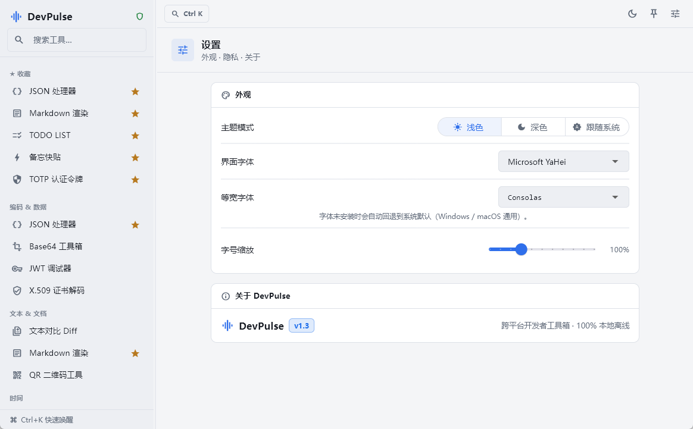

# DevPulse · 跨平台开发者工具箱

100% 本地离线的桌面开发者工具箱（Flutter Desktop，Windows / macOS / Linux）。对标暗色 IDE 的双栏工作台，集成 14 个高频工具，**无任何联网点、无统计 SDK、无云端同步**——所有数据仅在本机计算与存储。



## 功能模块

| 分组 | 模块 |
| --- | --- |
| 编码 & 数据 | JSON 处理器、Base64 工具箱、JWT 调试器、X.509 证书解码 |
| 文本 & 文档 | 文本对比 Diff、Markdown 渲染、QR 二维码工具 |
| 时间 | Unix 时间转换、Cron 表达式 |
| 安全 & 效率 | 加密工具（SHA/AES/RSA）、密码生成器、TOTP 认证令牌、TODO LIST、备忘快贴 |
| 系统 | 设置 |

## 全局能力

- **双栏响应式布局**：可拖拽调宽的侧栏 + 工具工作区，宽度持久化。
- **命令面板（Ctrl/Cmd+K）**：模糊搜索工具，或直接键入表达式即时运算。
- **工具收藏**：侧栏悬浮星标一键收藏，收藏项固定展示在顶部分组。
- **图钉置顶**：窗口常驻最前，便于对照 IDE 边看边调。
- **深/浅色主题**：对标 VS Code Dark+；界面字体、等宽字体、字号均可在设置里自定义（未安装的字体自动回退系统默认，Windows / macOS 通用）。
- **JSON 单框所见即所得**：格式化结果就地写回同一个可编辑框，内置折叠展开与内容搜索（Ctrl+F）。

## 安全与隐私

- TOTP 种子密钥存于系统级加密服务（Windows Credential Manager / macOS Keychain），绝无网络备份。
- 应用**零联网点**：不做任何网络请求，不采集任何使用数据。

## 技术栈

Flutter 3.44 / Dart 3.12 · Riverpod · Hive CE · window_manager · flutter_secure_storage ·
re_editor + re_highlight（JSON 折叠/搜索编辑器）· qr_flutter + zxing2 · markdown_widget ·
diff_match_patch · basic_utils + pointycastle（X.509 / RSA）· otp · pasteboard。

## 开发

```bash
flutter pub get
flutter run -d windows                      # 运行（也支持 -d macos / -d linux）
flutter test                                # 核心逻辑单元测试
flutter test integration_test -d windows    # 全模块构建冒烟（真机）
flutter analyze                             # 静态检查
```

## 构建发行包

推送 `v*` 标签会触发 GitHub Actions 自动构建 Windows / macOS / Linux 三平台安装包，详见 `.github/workflows/release.yml`。
